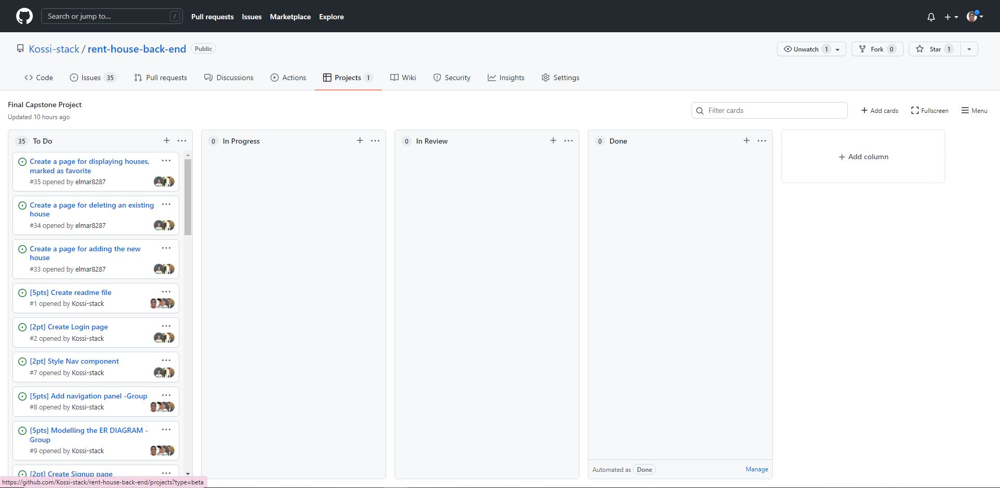

# The `House Rent` app on RoR

## The Back-end for Final Capstone Project

- This app is a Back-end side of final capstone project. You can find the Front-end app [here.](https://github.com/uzairali19/rent-house-front-end
)

- Direct link to [Kanban board](https://github.com/Kossi-stack/rent-house-back-end/projects/1) for whole capstone project

The final member number of this project is: 5!

## Built With

 Ruby on Rails 
 Postgres 
 Rspec

## Getting Started

To get a local copy up and run the app, follow these simple example steps.

## Prerequisites

 Ruby : 3.0.1
 Rails : 7.0.1
 Postgres > 14.0

## Setup
Clone the repository with:

    git@github.com:Kossi-stack/appointment-back-end.git

## Install
To install all dependencies, run:

    bundle install

Create database and seed the data

    rails db:create
    rails db:migrate
    rails db:seed

## Usage
To run the server, in the project directory, run:

    rails s

## Endpoints

If you are using the app localy

{defaultHost} = http://localhost:3000

👤👤 Authors

👤 ***Kossi Fioklou***
- Location:Lome, Togo
- GitHub: [@Kossi-stack](https://github.com/kossi-stack)
- LinkedIn: [@Kossi-stack](https://www.linkedin.com/in/kossi-stack/)

👤***Elmar***
- Location: Baku, Azerbaijan
- GitHub: [elmar8287](https://github.com/elmar8287)
- LinkedIn: [elmar.abdulkarimov](https://www.linkedin.com/in/elmar-abdulkarimov/)

# Microverse
# rent-house-back-end

👤 **Rustamxon**

- GitHub: [@githubhandle](https://github.com/Rustamxon7)
- LinkedIn: [LinkedIn](https://www.linkedin.com/in/rustamjon-tolipov-6a831020b)
- Twitter: [Twitter](https://twitter.com/Rustamjon7777)

👤 ***Isabella***
- Location: Nairobi, Kenya
- Github: [@Isabellanamutenda](https://github.com/Isabellanamutenda)
- Linkedin: [Isabellanamutenda](https://www.linkedin.com/in/isabella-namutenda/)

👤 ***Uzair***
- Location: Islamabad, Pakistan
- GitHub: [@uziarali](https://github.com/uzairali19)
- LinkedIn: [Uzair Ali](https://www.linkedin.com/in/uzairali19/)

### 🤝 Contributing
Contributions, issues, and feature requests are welcome!

Feel free to check the issues page.

### Show your support
Give a ⭐️ if you like this project!

### Acknowledgments
This project was inspired by Microverse

### 📝 License
This project is MIT license
